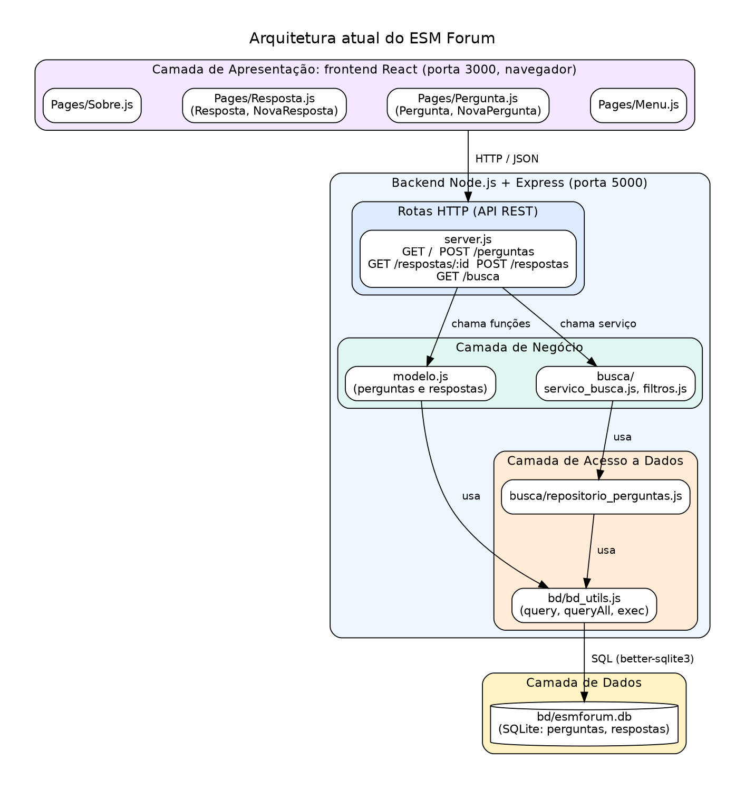

# Análise Arquitetural do ESM Forum

## a) Identificação da arquitetura

### Estilos arquiteturais

1. **Cliente-servidor.** O frontend (React) e o backend (Node.js + Express) são
   aplicações separadas, em repositórios diferentes, que rodam em portas
   diferentes e se comunicam pela rede.
2. **Arquitetura em camadas.** O sistema separa apresentação, negócio e dados,
   embora a separação no backend seja parcial (ver abaixo).
3. **API REST sobre HTTP, com JSON.** O backend expõe rotas e o frontend as
   consome, enviando e recebendo JSON.
4. **Aplicação de página única (SPA)** no frontend, com `react-router-dom`
   fazendo a navegação entre páginas.

### Camadas

| Camada | Onde está | Responsabilidade |
|---|---|---|
| Apresentação | frontend `esmforum-react`: `Pages/Menu.js`, `Pergunta.js`, `Resposta.js`, `Sobre.js` | interface com o usuário, formulários e exibição |
| Rotas (API) | `server.js` | receber requisições HTTP, chamar o backend, devolver JSON |
| Negócio | `modelo.js` e `busca/servico_busca.js`, `busca/filtros.js` | regras e operações de perguntas, respostas e busca |
| Acesso a dados | `bd/bd_utils.js` e `busca/repositorio_perguntas.js` | executar SQL e devolver os resultados |
| Dados | `bd/esmforum.db` (SQLite) | armazenar as tabelas `perguntas` e `respostas` |

**Limite da separação:** o `modelo.js` pertence à camada de negócio, mas escreve
SQL diretamente, o que mistura negócio e acesso a dados. A pasta `busca/`,
criada na Iteração 1, já separa os dois.

### Como frontend e backend se comunicam

O frontend (porta 3000) faz requisições HTTP ao backend (porta 5000), que
responde em JSON. O backend libera o acesso de outra origem com cabeçalhos CORS
no `server.js` (`Access-Control-Allow-Origin: *`).

| Rota | Operação |
|---|---|
| `GET /` | listar perguntas com o número de respostas |
| `POST /perguntas` | cadastrar uma pergunta |
| `GET /respostas/:id_pergunta` | obter uma pergunta e suas respostas |
| `POST /respostas` | cadastrar uma resposta |
| `GET /busca?q=palavra` | buscar perguntas por palavra-chave (Iteração 1) |

O backend precisa estar em execução antes do frontend, como diz o `README.md`
do `esmforum-react`.

### Fluxo de dados: listar perguntas

1. O usuário abre `localhost:3000`, e o React pede `GET /` ao backend.
2. A rota em `server.js` chama `modelo.listar_perguntas()`.
3. O `modelo.js` executa o SQL pelo `bd_utils.js` e calcula `num_respostas`.
4. O SQLite devolve as linhas, e o backend responde com JSON.
5. O React exibe a tabela de perguntas.

## b) Diagrama arquitetural

Fonte: `diagramas/arquitetura_atual.dot` (Graphviz).

O diagrama mostra os componentes de cada camada e o sentido das chamadas: o
frontend chama as rotas por HTTP/JSON, as rotas chamam o negócio, o negócio usa
o acesso a dados, e este executa SQL no banco SQLite.

## Pontos fortes e limitações

**Pontos fortes**
- Frontend e backend independentes, que podem evoluir separadamente.
- Backend pequeno e fácil de entender, com poucas dependências.
- A busca já segue uma separação em camadas e é testada sem banco de dados.

**Limitações**
- `server.js` mistura rotas, CORS e inicialização do servidor.
- `modelo.js` mistura regras de negócio com SQL.
- Não há autenticação: o `id_usuario` é fixo (`1`) ao cadastrar perguntas.
- O CORS está aberto para qualquer origem, o que serve para uso didático, mas
  não para produção.
