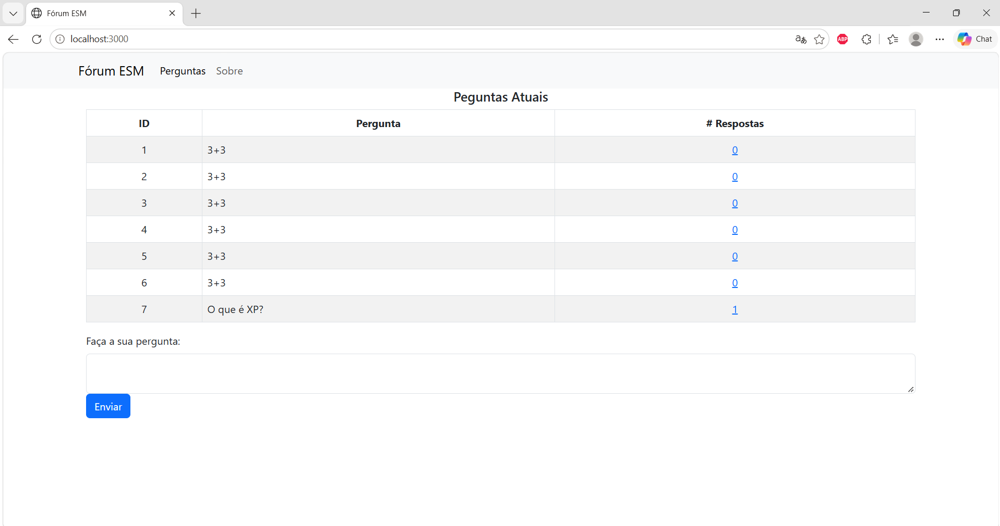
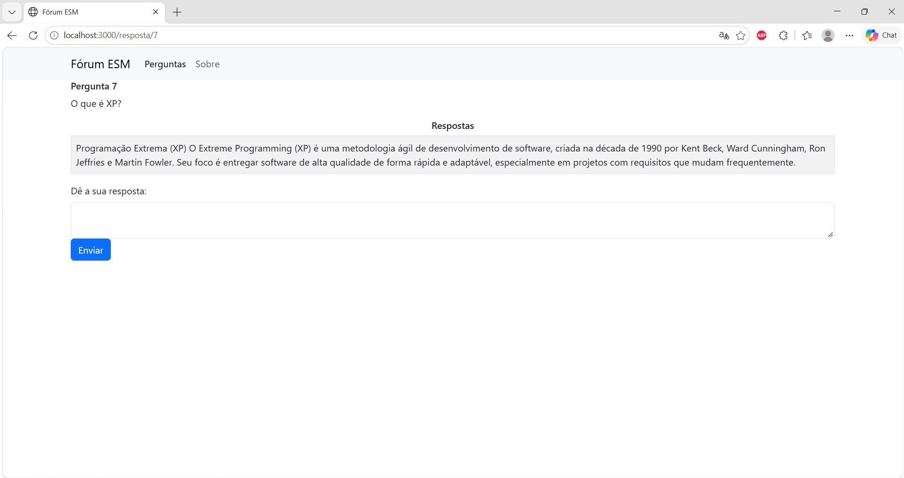

# Instalação e Execução do ESM Forum

Ambiente utilizado: Windows 11, VS Code, Git e Node.js 20.20.2.

## 1. Pré-requisitos
- Git
- Node.js 20 LTS (com npm)
- VS Code

## 2. Fork e clonagem
Fiz o fork dos repositórios `esmforum` e `esmforum-react` no GitHub e os clonei:

```
git clone https://github.com/evmdo-prog/esmforum.git
git clone https://github.com/evmdo-prog/esmforum-react.git
```

## 3. Instalação das dependências
```
cd esmforum
npm install
cd ../esmforum-react
npm install
```

### Problema encontrado
Com o Node.js 24, o `npm install` do backend falhou ao instalar o pacote
`better-sqlite3`: o npm tentou compilá-lo localmente com o `node-gyp`, o que
exige as ferramentas de C++ do Visual Studio.

**Solução:** instalei o Node.js 20 LTS, apaguei a pasta `node_modules` e
rodei `npm install` novamente, que terminou com sucesso. Os avisos de
pacotes obsoletos (`deprecated`) e de vulnerabilidades não impedem a execução.

## 4. Execução
São necessários dois terminais abertos ao mesmo tempo.

**Backend** (porta 5000):
```
cd esmforum
node server.js
```

**Frontend** (porta 3000):
```
cd esmforum-react
npm start
```

O frontend abre em http://localhost:3000. O backend deve estar rodando antes.
O frontend compila com 1 aviso de lint em `src/pages/Resposta.js`, que não
afeta a execução.

## 5. Verificação
Cadastrei uma pergunta e uma resposta pela interface, e o contador de
respostas foi atualizado na listagem.



