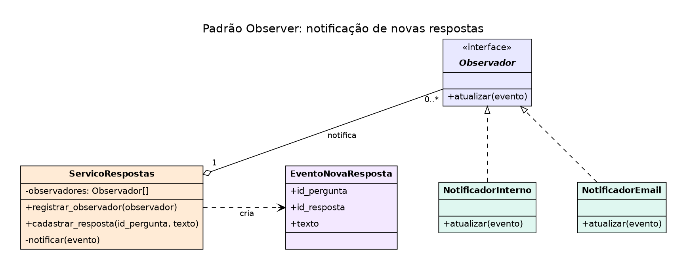
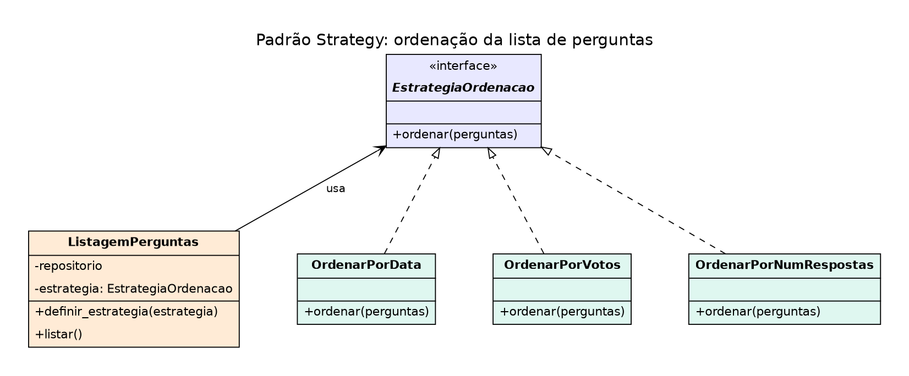
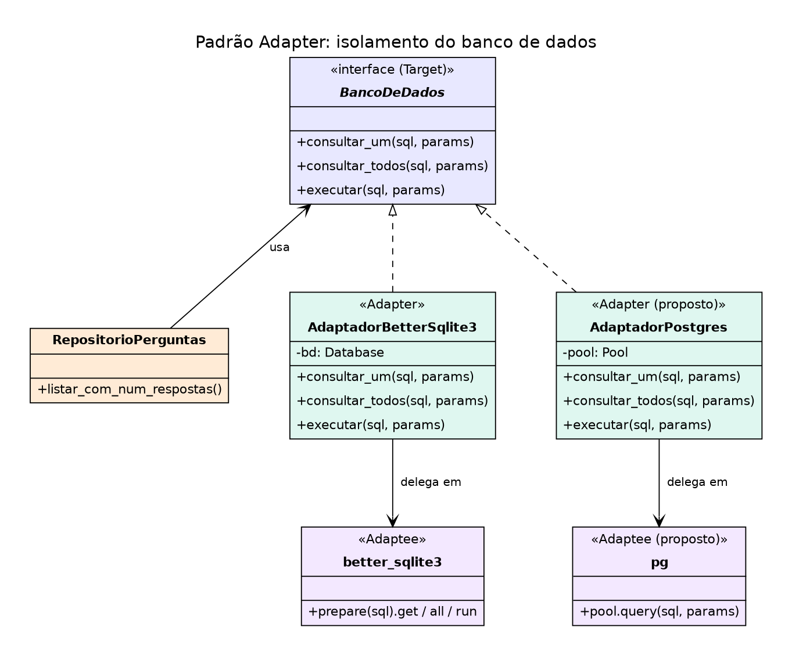

# Proposta de Aplicação de Padrões de Projeto

Três padrões são propostos para as funcionalidades do ESM Forum: **Observer**
(notificação de novas respostas), **Strategy** (ordenação da lista de
perguntas) e **Adapter** (isolamento do banco de dados).

Os diagramas estão na pasta `diagramas/`, cada um com a imagem (`.png`) e o
fonte (`.dot`, Graphviz).

---

## 1. Observer: notificação de novas respostas

### a) Justificativa e contexto

**Funcionalidade:** notificação de novas respostas (card #5 do board).

**Problema:** quando uma resposta é cadastrada, o autor da pergunta deve ser
avisado. Se a regra de notificação for escrita dentro de `cadastrar_resposta`,
essa função passa a conhecer e-mail, notificações internas e qualquer canal
futuro, e cada novo canal obriga a editá-la.

**Por que o Observer:** ele separa quem produz o evento (o serviço de
respostas) de quem reage a ele (os notificadores). Novos canais são
acrescentados sem alterar o serviço, o que também respeita o OCP.

### b) Proposta de solução



Fonte: `diagramas/padrao_observer.dot`.

| Elemento | Papel | Responsabilidade |
|---|---|---|
| `Observador` | contrato | define `atualizar(evento)` |
| `ServicoRespostas` | Subject | grava a resposta e avisa os observadores |
| `EventoNovaResposta` | evento | carrega `id_pergunta`, `id_resposta` e `texto` |
| `NotificadorInterno` | observador concreto | grava uma notificação para o autor |
| `NotificadorEmail` | observador concreto | envia um e-mail ao autor |

**Interação:**
1. A rota `POST /respostas` chama `ServicoRespostas.cadastrar_resposta`.
2. O serviço grava a resposta no repositório.
3. O serviço cria o evento e chama `atualizar(evento)` em cada observador
   registrado.
4. Cada observador decide o que fazer com o evento, de forma independente.

Os observadores são registrados em um único ponto, na montagem das dependências
do `server.js`.

### c) Exemplo de código (simplificado)

```js
class ServicoRespostas {
  constructor(repositorio_respostas) {
    this.repositorio = repositorio_respostas;
    this.observadores = [];
  }

  registrar_observador(observador) {
    this.observadores.push(observador);
  }

  cadastrar_resposta(id_pergunta, texto) {
    const id_resposta = this.repositorio.inserir(id_pergunta, texto);
    this._notificar({ id_pergunta, id_resposta, texto });
    return id_resposta;
  }

  _notificar(evento) {
    this.observadores.forEach((observador) => observador.atualizar(evento));
  }
}

class NotificadorInterno {
  constructor(repositorio_notificacoes, repositorio_perguntas) {
    this.notificacoes = repositorio_notificacoes;
    this.perguntas = repositorio_perguntas;
  }

  atualizar(evento) {
    const id_autor = this.perguntas.buscar_autor(evento.id_pergunta);
    this.notificacoes.inserir(id_autor, `Sua pergunta ${evento.id_pergunta} recebeu uma resposta`);
  }
}

// montagem (server.js)
servico_respostas.registrar_observador(new NotificadorInterno(notificacoes, perguntas));
servico_respostas.registrar_observador(new NotificadorEmail(enviador_de_email));
```

**Observação:** o sistema atual grava sempre `id_usuario = 1`. A notificação só
terá efeito real depois da funcionalidade de perfil de usuário (card #4).

---

## 2. Strategy: ordenação da lista de perguntas

### a) Justificativa e contexto

**Funcionalidade:** listagem de perguntas, combinada com a votação (card #2).

**Problema:** hoje a lista aparece sempre na mesma ordem. Com votos, os usuários
vão querer ordenar por data, por votos ou por número de respostas. Escrever
isso com vários `if` na função de listagem faria o código crescer a cada novo
critério.

**Por que o Strategy:** cada forma de ordenar vira um objeto intercambiável com
a mesma interface. A listagem escolhe a estratégia em tempo de execução, e
novas ordenações não alteram o código existente.

**Diferença em relação à busca:** os filtros da busca (Iteração 1) decidem
*quais* perguntas aparecem. As estratégias de ordenação decidem *em que ordem*.

### b) Proposta de solução



Fonte: `diagramas/padrao_strategy.dot`.

| Elemento | Papel | Responsabilidade |
|---|---|---|
| `EstrategiaOrdenacao` | contrato | define `ordenar(perguntas)` |
| `ListagemPerguntas` | Context | busca as perguntas e aplica a estratégia escolhida |
| `OrdenarPorData` | estratégia | ordena da mais recente para a mais antiga |
| `OrdenarPorVotos` | estratégia | ordena pelo total de votos |
| `OrdenarPorNumRespostas` | estratégia | ordena pelo número de respostas |

**Interação:**
1. A rota `GET /?ordem=votos` lê o parâmetro `ordem`.
2. O controlador escolhe a estratégia correspondente (ou a padrão).
3. A `ListagemPerguntas` carrega as perguntas e delega a ordenação à estratégia.

### c) Exemplo de código (simplificado)

```js
const ordenar_por_data = {
  ordenar: (perguntas) => [...perguntas].sort((a, b) => b.id_pergunta - a.id_pergunta),
};
const ordenar_por_votos = {
  ordenar: (perguntas) => [...perguntas].sort((a, b) => b.total_votos - a.total_votos),
};
const ordenar_por_respostas = {
  ordenar: (perguntas) => [...perguntas].sort((a, b) => b.num_respostas - a.num_respostas),
};

const estrategias = { data: ordenar_por_data, votos: ordenar_por_votos, respostas: ordenar_por_respostas };

class ListagemPerguntas {
  constructor(repositorio, estrategia = ordenar_por_data) {
    this.repositorio = repositorio;
    this.estrategia = estrategia;
  }

  definir_estrategia(estrategia) {
    this.estrategia = estrategia;
  }

  listar() {
    return this.estrategia.ordenar(this.repositorio.listar_com_num_respostas());
  }
}

// controlador: GET /?ordem=votos
const estrategia = estrategias[req.query.ordem] || estrategias.data;
listagem.definir_estrategia(estrategia);
res.json(listagem.listar());
```

**Observações:** a tabela de perguntas não tem data de criação, então "por data"
usa o `id_pergunta` como aproximação (ids maiores são mais recentes). A
ordenação por votos depende da funcionalidade de votação (`total_votos`).

---

## 3. Adapter: isolamento do banco de dados

### a) Justificativa e contexto

**Funcionalidade:** acesso a dados de todo o sistema (perguntas, respostas, votos
e tags).

**Problema:** o `bd_utils.js` expõe objetos da biblioteca `better-sqlite3` (por
exemplo, o resultado de `run`, com `lastInsertRowid`). O código que usa o banco
fica acoplado a essa biblioteca, e trocar o SQLite por outro banco exigiria
mudar vários arquivos.

**Por que o Adapter:** ele traduz a interface de cada biblioteca para um contrato
único, que o sistema define. O restante do código fala apenas com o contrato.

### b) Proposta de solução



Fonte: `diagramas/padrao_adapter.dot`.

| Elemento | Papel | Responsabilidade |
|---|---|---|
| `BancoDeDados` | Target (contrato) | define `consultar_um`, `consultar_todos` e `executar` |
| `AdaptadorBetterSqlite3` | Adapter | traduz o contrato para a API do `better-sqlite3` |
| `AdaptadorPostgres` | Adapter (proposto) | traduz o contrato para a API do `pg` |
| `RepositorioPerguntas` | cliente | usa apenas o contrato `BancoDeDados` |

**Interação:** os repositórios recebem um objeto que cumpre o contrato. Na
montagem do `server.js`, escolhe-se qual adaptador usar, e o restante do código
não muda.

### c) Exemplo de código (simplificado)

```js
// Contrato esperado pelos repositórios:
//   consultar_um(sql, params), consultar_todos(sql, params), executar(sql, params)

class AdaptadorBetterSqlite3 {
  constructor(caminho) {
    this.bd = new Database(caminho);
  }
  consultar_um(sql, params) { return this.bd.prepare(sql).get(params); }
  consultar_todos(sql, params) { return this.bd.prepare(sql).all(params); }
  executar(sql, params) {
    const r = this.bd.prepare(sql).run(params);
    return { id_inserido: r.lastInsertRowid };
  }
}

class AdaptadorPostgres {
  constructor(pool) { this.pool = pool; }
  async consultar_todos(sql, params) {
    const r = await this.pool.query(trocar_interrogacoes_por_numeros(sql), params);
    return r.rows;
  }
  // consultar_um e executar seguem a mesma ideia
}

// montagem (server.js)
const banco = new AdaptadorBetterSqlite3('./bd/esmforum.db');
const repositorio = criar_repositorio_perguntas(banco);
```

**Observação:** o `pg` é assíncrono, enquanto o `better-sqlite3` é síncrono.
Para usar os dois adaptadores com o mesmo contrato, o contrato precisaria
devolver `Promise` (e os repositórios usariam `await`). Essa é a principal
mudança que a troca de banco exigiria.
