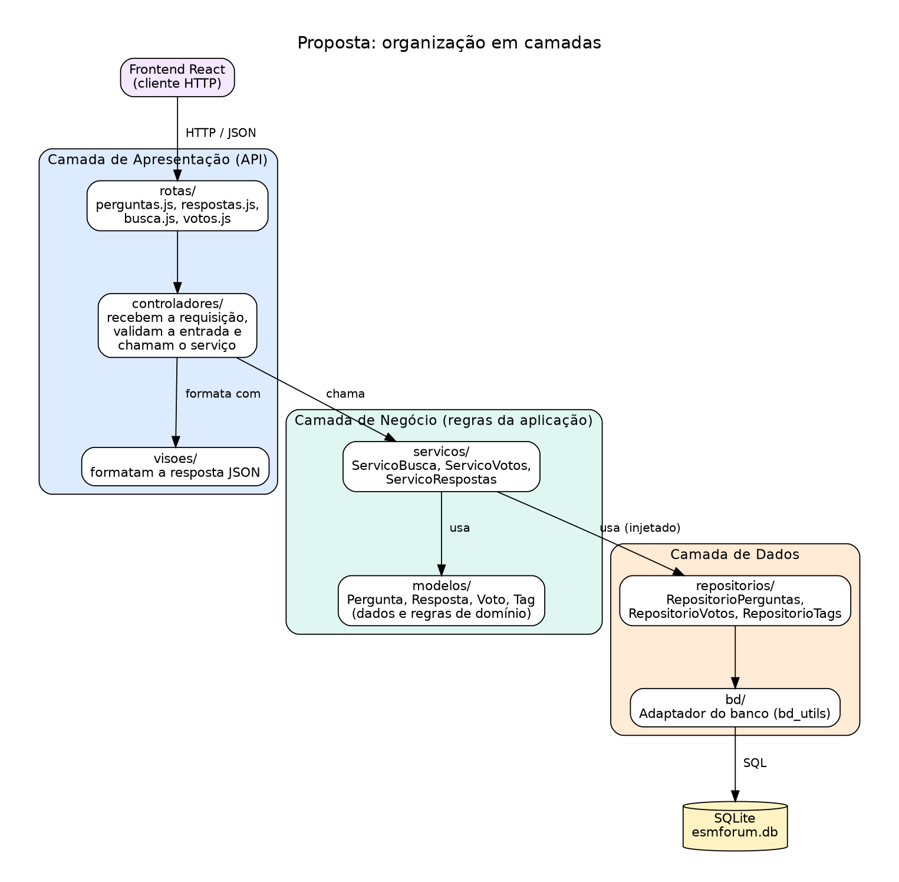
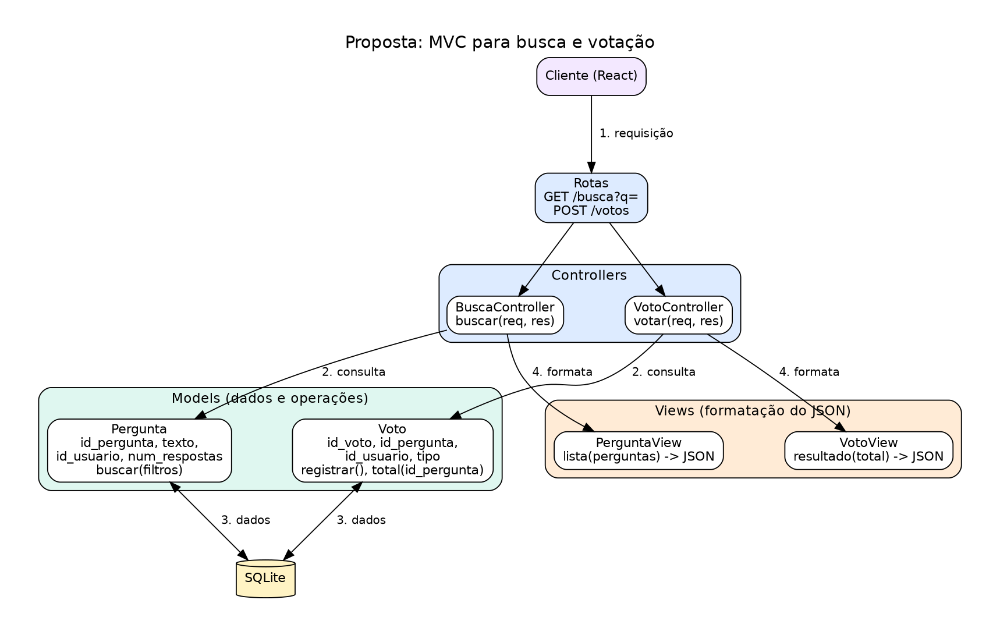

# Proposta de Organização Arquitetural

A proposta organiza o backend em camadas bem definidas e aplica o padrão MVC às
funcionalidades de **busca** e **votação**. Os diagramas estão em `diagramas/`,
com imagem (`.png`) e fonte (`.dot`, Graphviz).

---

## a) Separação em camadas



Fonte: `diagramas/proposta_camadas.dot`.

### Estrutura de pastas proposta

```
esmforum/
  server.js              (monta as dependências e inicia o servidor)
  rotas/                 perguntas.js, respostas.js, busca.js, votos.js
  controladores/         PerguntaController, BuscaController, VotoController
  visoes/                PerguntaView, VotoView
  servicos/              ServicoBusca, ServicoVotos, ServicoRespostas
  modelos/               Pergunta, Resposta, Voto, Tag
  repositorios/          RepositorioPerguntas, RepositorioVotos, RepositorioTags
  bd/                    bd_utils.js (adaptador do banco) e esmforum.db
```

### Camada de Apresentação (API)

**Responsabilidades**
- Receber a requisição HTTP e ler os parâmetros.
- Validar a entrada (por exemplo, `tipo` do voto deve ser `up` ou `down`).
- Chamar o serviço correspondente.
- Montar a resposta JSON e escolher o código HTTP.

**Módulos:** `rotas/`, `controladores/` e `visoes/`.

**Não faz:** regras de negócio nem SQL.

### Camada de Negócio

**Responsabilidades**
- Aplicar as regras da aplicação: um voto por usuário em cada pergunta, a
  troca de voto, a combinação de filtros da busca, a notificação de respostas.
- Coordenar os repositórios.

**Módulos:** `servicos/` (como o `ServicoBusca` e o `ServicoVotos`) e
`modelos/` (as entidades `Pergunta`, `Voto` e `Tag`, com seus dados).

**Não faz:** SQL, nem `req` e `res` do HTTP.

### Camada de Dados

**Responsabilidades**
- Executar o SQL e devolver os resultados.
- Esconder o esquema das tabelas do restante do sistema.

**Módulos:** `repositorios/` (cada um com o SQL de uma entidade) e `bd/`
(o adaptador do banco, o `bd_utils.js` atual).

**Não faz:** regras de negócio.

### Comunicação entre as camadas

- Cada camada fala **somente com a camada imediatamente abaixo**: apresentação
  chama negócio, negócio chama dados.
- As dependências são **injetadas** na montagem do `server.js`, como já foi
  feito na busca (`criar_servico_busca(criar_repositorio_perguntas(bd))`),
  então cada camada recebe a de baixo por parâmetro e pode ser testada com um
  substituto.
- As camadas de baixo nunca conhecem as de cima.

### Como a organização atual evoluiria

| Hoje | Passa a ser |
|---|---|
| rotas em `server.js` | `rotas/*.js`, cada uma só liga a URL ao controlador |
| `modelo.js` (SQL + regras) | regras em `servicos/`, SQL em `repositorios/` |
| `bd_utils.js` | continua como adaptador do banco |
| pasta `busca/` | já segue o desenho e vira `ServicoBusca` e `RepositorioPerguntas` |

---

## b) Padrão MVC no backend



Fonte: `diagramas/proposta_mvc.dot`.

Como o backend é uma API que devolve JSON, a **View** não é uma tela: é a
formatação da resposta JSON. A tela continua sendo responsabilidade do
frontend React.

### Funcionalidade 1: busca por palavra-chave

**Model**
- `Pergunta`: `id_pergunta`, `texto`, `id_usuario`, `num_respostas`.
- Operação: buscar perguntas aplicando filtros (`ServicoBusca.buscar(filtros)`).

**View**
- `PerguntaView.lista(perguntas)`: devolve o JSON da lista, com apenas os campos
  que o frontend usa.

**Controller**
- `BuscaController.buscar(req, res)`: lê `q` da URL, monta os filtros, chama o
  serviço e entrega o resultado à view.

### Funcionalidade 2: votação

**Model**
- `Voto`: `id_voto`, `id_pergunta`, `id_usuario`, `tipo` (`up` ou `down`).
- Operações: registrar ou trocar o voto e calcular o total de votos de uma
  pergunta (`ServicoVotos.votar(...)`, `ServicoVotos.total(id_pergunta)`).

**View**
- `VotoView.resultado(total)`: devolve o JSON com o total atualizado.

**Controller**
- `VotoController.votar(req, res)`: lê `id_pergunta` e `tipo`, valida a entrada,
  chama o serviço e entrega o total à view. Responde `404` se a pergunta não
  existir.

### Exemplo de fluxo completo: `GET /busca?q=xp`

1. O frontend envia `GET /busca?q=xp`.
2. A rota `rotas/busca.js` encaminha ao `BuscaController.buscar`.
3. O controller lê `q = "xp"` e monta o filtro de palavra-chave.
4. O `ServicoBusca` pede ao `RepositorioPerguntas` as perguntas com a contagem
   de respostas.
5. O repositório executa o SQL pelo adaptador do banco e devolve as linhas.
6. O serviço mantém só as perguntas que passam pelo filtro.
7. O controller entrega a lista à `PerguntaView`, que monta o JSON.
8. O controller responde `200` com o JSON, e o React exibe o resultado.

Exemplo de resposta:

```json
[{"id_pergunta": 7, "texto": "O que é XP?", "id_usuario": 1, "num_respostas": 1}]
```

### Exemplo de fluxo completo: `POST /votos`

1. O frontend envia `POST /votos` com `{ "id_pergunta": 7, "tipo": "up" }`.
2. A rota encaminha ao `VotoController.votar`, que valida os dados.
3. O `ServicoVotos` consulta o `RepositorioVotos`: o usuário já votou nessa
   pergunta?
   - Não votou: grava o voto.
   - Votou o tipo oposto: troca o voto.
   - Votou o mesmo tipo: mantém o voto.
4. O serviço calcula o total de votos da pergunta.
5. O controller entrega o total à `VotoView`, que monta o JSON.
6. O controller responde `200` com `{ "total": 3 }`.

### Benefícios da proposta

- Cada funcionalidade tem seus próprios controller, model e view, o que reduz o
  acoplamento e evita que um arquivo único cresça a cada funcionalidade.
- O `ServicoBusca` e o `ServicoVotos` podem ser testados sem HTTP e sem banco.
- Mudar o formato do JSON afeta só as views, e mudar o banco afeta só os
  repositórios.

### Limitações e pontos de atenção

- A votação depende de identificar o usuário. Hoje o sistema grava `id_usuario = 1`,
  então a regra de "um voto por usuário" só terá efeito pleno com o perfil de
  usuário.
- Para um sistema tão pequeno, a estrutura proposta tem mais arquivos do que o
  necessário hoje. O ganho aparece conforme as cinco funcionalidades do board
  forem implementadas.
